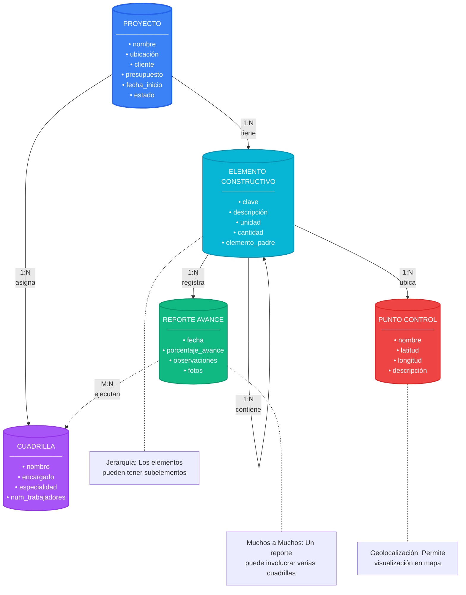

# Sisteama de control de obras civiles

### **Pain Points Actuales en Construcción:**

1. **Desconexión entre oficina y campo**
    - Planos en CAD (coordenadas locales)
    - GPS en obra (WGS84)
    - Levantamientos topográficos (UTM)
    -  Sin sistema unificado
2. **Control de avance ineficiente**
    - Reportes manuales
    - Fotos sin geolocalización precisa
    - Mediciones no verificables
    - Cálculo de volúmenes manual
3. **Problemas de replanteo**
    - Errores de conversión de coordenadas
    - Falta de precisión en GPS comercial
    - Pérdida de tiempo en campo
4. **Gestión de recursos**
    - No saber dónde está cada cuadrilla
    - Materiales sin rastreo preciso
    - Maquinaria subutilizada

