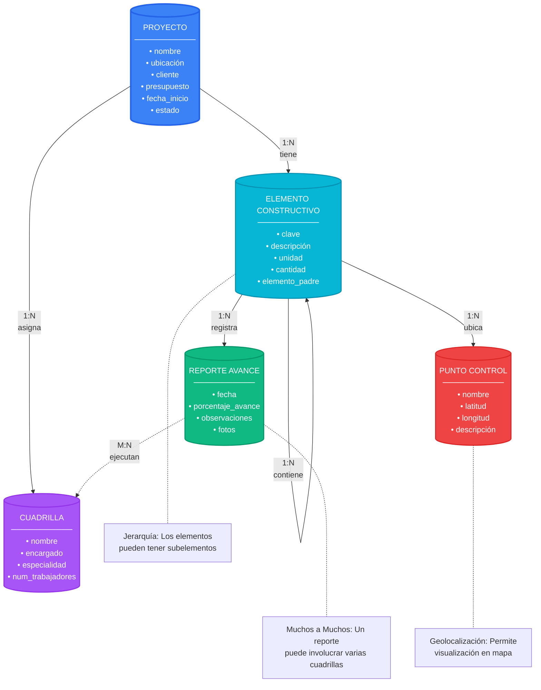

# Sisteama de control de obras civiles


Esta guía detalla el proceso paso a paso para configurar y ejecutar un proyecto Django existente en tu entorno local a partir de su archivo `requirements.txt`.

## Prerrequisitos

Antes de comenzar, asegúrate de tener instalado en tu sistema:
- **Python** (Versión 3.8 o superior recomendada)
- **Git** (Opcional, en caso de necesitar clonar el repositorio)

---

## Paso 1: Acceder a la carpeta del proyecto

Abre tu terminal (o símbolo del sistema) y navega hasta la raíz de la carpeta que contiene el proyecto Django.


## Paso 2: Crear un Entorno Virtual

Es fundamental crear un entorno virtual para aislar las dependencias de este proyecto y evitar conflictos con otras librerías globales de tu sistema.

En la raíz del proyecto, ejecuta el siguiente comando:

**En Windows:**

```bash
python -m venv venv
```

**En macOS y Linux:**

```bash
python3 -m venv venv
```

*Nota: El segundo `venv` es el nombre de la carpeta donde se guardará el entorno virtual. Puedes cambiarlo si lo deseas, pero `venv` es el estándar.*

## Paso 3: Activar el Entorno Virtual

Debes activar el entorno virtual antes de proceder con la instalación de paquetes. El comando varía según tu sistema operativo y la terminal que uses:

**En Windows (PowerShell):**

```powershell
.\\venv\\Scripts\\Activate.ps1
```

**En Windows (CMD / Símbolo del sistema):**

```bash
venv\\Scripts\\activate.bat
```


Una vez activado, verás que el nombre de tu terminal cambia y muestra `(venv)` al inicio de la línea de comandos.

## Paso 4: Instalar las Dependencias (`requirements.txt`)

Con el entorno virtual debidamente activado, instala todas las librerías necesarias requeridas por el proyecto ejecutando:

```bash
pip install -r requirements.txt
```

Esto leerá el archivo `requirements.txt` e instalará de forma automática Django y cualquier otra dependencia que el proyecto necesite.

## Paso 5: Configurar la Base de Datos y Migraciones

Por defecto, la mayoría de los proyectos Django vienen configurados para usar una base de datos local ligera llamada **SQLite**, la cual no requiere instalación adicional.

*(Si el proyecto requiere bases de datos como PostgreSQL o MySQL, asegúrate de tener creado el esquema de la base de datos y configurar las credenciales correctas en el archivo `.env` o dentro de `settings.py`).*

Para crear la estructura de tablas necesaria en la base de datos a partir de los modelos de Django, ejecuta:

```bash
python manage.py migrate
```

## Paso 6: Crear un Superusuario (Administrador)

Para tener acceso completo al panel de control de administración integrado de Django, necesitas generar una cuenta de administrador:

```bash
python manage.py createsuperuser
```

La terminal te pedirá que introduzcas:

1. **Username** (Nombre de usuario)
2. **Email address** (Dirección de correo - opcional)
3. **Password** (Contraseña - *nota: no se mostrarán caracteres mientras escribes por seguridad*)

## Paso 7: Iniciar el Servidor de Desarrollo

¡Todo está listo! Ahora puedes arrancar el servidor local de Django para empezar a probar la aplicación:

```bash
python manage.py runserver
```

Verás una salida en la terminal indicando que el servidor se está ejecutando correctamente. Abre tu navegador web favorito e ingresa a la siguiente dirección:

👉 [http://127.0.0.1:8000/](http://127.0.0.1:8000/)

Para acceder al panel de administración, ve a:
👉 [http://127.0.0.1:8000/admin](http://127.0.0.1:8000/admin) e inicia sesión con las credenciales creadas en el Paso 6.

---

## Tabla de Referencia Rápida (Comandos Básicos)

| Acción | Comando |
| --- | --- |
| **Activar entorno (Mac/Linux)** | `source venv/bin/activate` |
| **Activar entorno (Windows PS)** | `.\\venv\\Scripts\\Activate.ps1` |
| **Instalar requerimientos** | `pip install -r requirements.txt` |
| **Crear/Actualizar Base de Datos** | `python manage.py migrate` |
| **Crear Administrador** | `python manage.py createsuperuser` |
| **Iniciar Servidor** | `python manage.py runserver` |
| **Desactivar Entorno Virtual** | `deactivate` |
| """ |  |


### **Pain Points Actuales en Construcción:**

1. **Desconexión entre oficina y campo**
    - Planos en CAD (coordenadas locales)
    - GPS en obra (WGS84)
    - Levantamientos topográficos (UTM)
    -  Sin sistema unificado
2. **Control de avance ineficiente**
    - Reportes manuales
    - Fotos sin geolocalización precisa
    - Mediciones no verificables
    - Cálculo de volúmenes manual
3. **Problemas de replanteo**
    - Errores de conversión de coordenadas
    - Falta de precisión en GPS comercial
    - Pérdida de tiempo en campo
4. **Gestión de recursos**
    - No saber dónde está cada cuadrilla
    - Materiales sin rastreo preciso
    - Maquinaria subutilizada



```mermaid
graph TB
    %% Estilos
    classDef proyectoStyle fill:#3b82f6,stroke:#2563eb,stroke-width:3px,color:#fff
    classDef elementoStyle fill:#06b6d4,stroke:#0891b2,stroke-width:2px,color:#fff
    classDef reporteStyle fill:#10b981,stroke:#059669,stroke-width:2px,color:#fff
    classDef cuadrillaStyle fill:#a855f7,stroke:#9333ea,stroke-width:2px,color:#fff
    classDef puntoStyle fill:#ef4444,stroke:#dc2626,stroke-width:2px,color:#fff

    %% Nodos principales
    P[("PROYECTO<br/>───────────<br/>• nombre<br/>• ubicación<br/>• cliente<br/>• presupuesto<br/>• fecha_inicio<br/>• estado")]:::proyectoStyle
    
    E[(" ELEMENTO CONSTRUCTIVO<br/>───────────<br/>• clave<br/>• descripción<br/>• unidad<br/>• cantidad<br/>• elemento_padre")]:::elementoStyle
    
    R[(" REPORTE AVANCE<br/>───────────<br/>• fecha<br/>• porcentaje_avance<br/>• observaciones<br/>• fotos")]:::reporteStyle
    
    C[(" CUADRILLA<br/>───────────<br/>• nombre<br/>• encargado<br/>• especialidad<br/>• num_trabajadores")]:::cuadrillaStyle
    
    PC[(" PUNTO CONTROL<br/>───────────<br/>• nombre<br/>• latitud<br/>• longitud<br/>• descripción")]:::puntoStyle

    %% Relaciones
    P -->|"1:N<br/>tiene"| E
    E -->|"1:N<br/>contiene"| E
    E -->|"1:N<br/>registra"| R
    P -->|"1:N<br/>asigna"| C
    R -.->|"M:N<br/>ejecutan"| C
    E -->|"1:N<br/>ubica"| PC

    %% Notas explicativas
    Note1[" Jerarquía: Los elementos<br/>pueden tener subelementos"]
    Note2[" Muchos a Muchos: Un reporte<br/>puede involucrar varias cuadrillas"]
    Note3[" Geolocalización: Permite<br/>visualización en mapa"]
    
    E -..- Note1
    R -..- Note2
    PC -..- Note3
```
